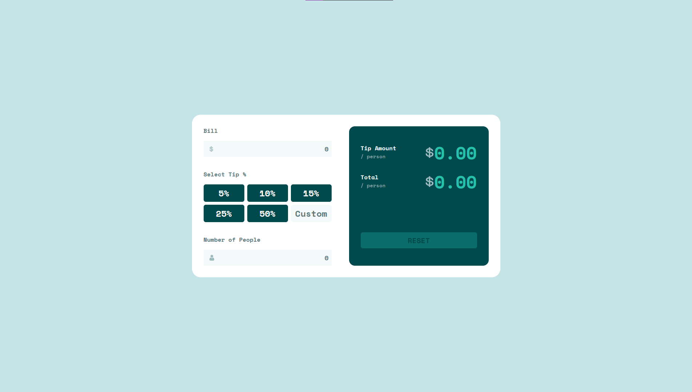

# Frontend Mentor - Tip calculator app solution

This is a solution to the [Tip calculator app challenge on Frontend Mentor](https://www.frontendmentor.io/challenges/tip-calculator-app-ugJNGbJUX/hub). Frontend Mentor challenges help you improve your coding skills by building realistic projects.

## Table of contents

- [Overview](#overview)
  - [The challenge](#the-challenge)
  - [Screenshot](#screenshot)
  - [Built with](#built-with)
  - [Links](#links)
- [Author](#author)

## Overview

This one is pretty challenging for me since I am still learning javascript. I honestly don't know how to learn code without hands on practice lmao. anyways this one is a tough one for a beginner like me, but I'll be better.

### The challenge

Users should be able to:

- View the optimal layout for the interface depending on their device's screen size
- See hover and focus states for all interactive elements on the page

### Screenshot

### Links

Site Link: https://article-preview-component-master-kohis-solution.vercel.app

### Built with

- Semantic HTML5 markup
- Grid
- Flexbox
- CSS Grid
- TailwindCSS
- JavaScript

# Author

- Frontend Mentor - [@kohicha](https://www.frontendmentor.io/profile/kohicha)
- Twitter - [@eepykohi](https://twitter.com/eepykohi)

